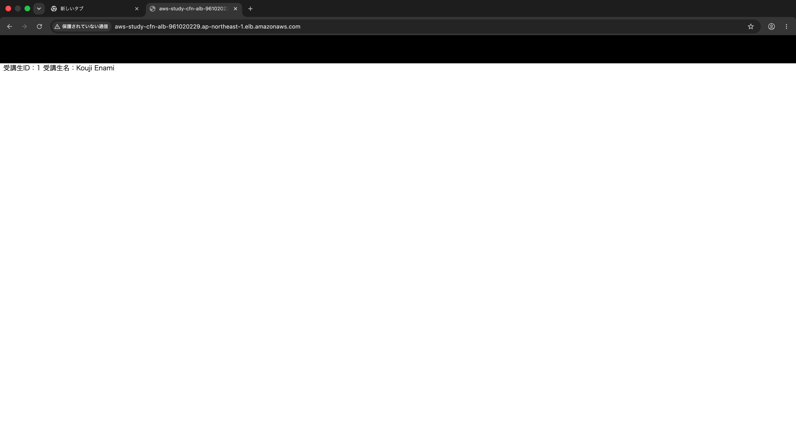
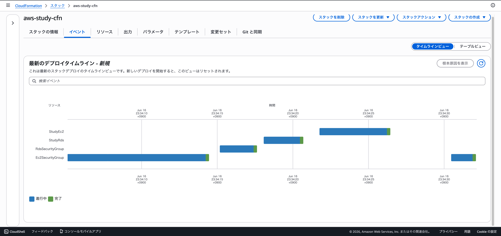

# aws-study-cfn

AWS CloudFormation で VPC / サブネット（public・private 各2AZ）/ IGW / ルート / EC2 / RDS(MySQL) / ALB のフルスタックを1枚の `template.yaml` で定義する学習用リポジトリ。EC2 の UserData でアプリを自動セットアップし、ALB 経由でアクセスできる構成にしている。

## 構成

- **VPC**（10.0.0.0/16）+ public / private サブネット 各2AZ + IGW + ルートテーブル
- **EC2**（t3.micro）… UserData で自動デプロイ。SSH は開放せず、8080 は ALB のセキュリティグループからのみ許可
- **RDS**（MySQL・db.t3.micro）… private サブネット・`PubliclyAccessible: false`
- **ALB**（internet-facing）→ ターゲットグループ（8080）→ EC2
- DB パスワードは `NoEcho` パラメータで受け取り、テンプレートに直書きしない

## デプロイ

```bash
cfn-lint template.yaml
aws cloudformation deploy \
  --template-file template.yaml \
  --stack-name aws-study-cfn \
  --region ap-northeast-1 \
  --parameter-overrides DBPassword=<パスワード>
```

## 動作確認

ALB の URL 経由でアプリに到達できる：



CloudFormation スタックが正常に作成完了：


